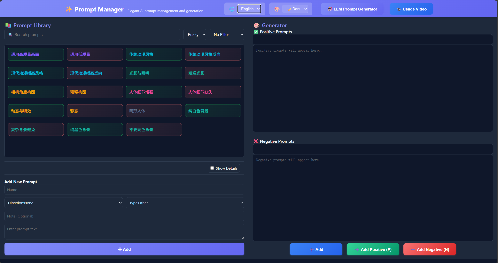

# 🎨 ComfyUI Prompt Manager

An elegant AI prompt management and generation system designed for ComfyUI. Efficiently manage, search, and generate Stable Diffusion prompts.

***
NOTICE: English version of default prompts re available in `datas/prompts_default.en.json`, just replace the context of `datas/prompts.json` with `datas/prompts_default_en.json` to use for English users.
***

**[中文](README.md) | [English](README.en.md)**



---

## ⚡ Quick Installation & Usage

### 1️⃣ Installation

Clone or download the plugin to ComfyUI's custom nodes directory:

```bash
cd path/to/ComfyUI/custom_nodes
git clone https://github.com/CeasarSmj/comfyui_PromptManage.git
```

Restart ComfyUI and visit `http://localhost:8188/prompt_manage_web/` or click the plugin button in the ComfyUI web interface.

### 2️⃣ Core Concepts

The plugin has two main sections:

| Section | Purpose |
|---------|---------|
| **Left Panel** | Prompt Library - Add, edit, delete, search prompts |
| **Right Panel** | Prompt Generator - Combine prompts to create positive/negative prompt pairs |

Each prompt contains:
- **Name**: Short identifier (e.g., "landscape", "beautiful woman")
- **Direction**: Positive (what to generate) / Negative (what to avoid) / None
- **Type**: Classification - Quality, Style, Texture, Environment, Action, Expression, Clothing, Composition, Other
- **Prompt Text**: Complete prompt content
- **Note** (optional): Usage tips and descriptions

---

## 🎯 Core Usage Methods

### 📚 Manage Prompt Library

#### Add a Prompt
1. Fill in the "Add New Prompt" form on the left:
   - **Name**: e.g., "high quality image", "beautiful girl"
   - **Direction**: Select "Positive", "Negative", or "None"
   - **Type**: Choose from the dropdown menu
   - **Note** (optional): e.g., "for character generation"
   - **Prompt Text**: Paste your prompt content
2. Click "✚ Add" to save

#### Search and Filter
- **Search Box**: Type keywords to find prompts (supports both fuzzy and exact matching)
- **Type Filter**: Filter by classification from dropdown
- **Show Details**: Check to view complete information for each prompt

#### Edit or Delete
1. Click a prompt in the list to select it (button will highlight)
2. Edit: Click "✏️ Edit Selected" → Modify information → Click "✓ Confirm Edit"
3. Delete: Click "🗑️ Delete Selected" → Confirm deletion

### 🎨 Generate Prompts

#### Method 1: Manual Combination (Recommended for Beginners)
1. Select a prompt from the library on the left
2. Click a button to add to the right generator:
   - **➕ Add**: System auto-detects direction and adds to appropriate area
   - **➕ Add Positive (P)**: Force add to positive prompt area
   - **➖ Add Negative (N)**: Force add to negative prompt area
3. Prompt text automatically appends to the text box on the right
4. Continue adding more prompts to create combinations
5. Copy the final result to use in ComfyUI

#### Method 2: Keyboard Shortcuts (Efficient)
- Select a prompt then press **`P` key**: Quickly add to positive prompts
- Select a prompt then press **`N` key**: Quickly add to negative prompts

#### Method 3: LLM AI Generation (Professional)
1. Click "🤖 LLM Prompt Generator" in the top-right
2. Describe your needs in natural language:
   ```
   A smiling woman in a red dress in a garden, sunlight, soft lighting
   ```
3. Click "⚡ Generate" button
4. System generates standardized prompt based on preset rules
5. Click "📋 Copy" to copy the generated content
6. Optional: Paste into text box for further fine-tuning

### 🎛️ Interface Settings

- **Language**: Click "🌐" in top-left to switch between Chinese and English
- **Theme**: Click "🎨" in top-left to toggle between light and dark modes
- **Auto-Save**: Preferences automatically saved to browser local storage

---

## 📹 Video Tutorial

Click "📹 Usage Video" in the top-right to watch the complete usage tutorial (includes demonstrations and tips)

---

## ✨ Features

- ✅ **Prompt Library Management** - Easily create, edit, delete, and search
- ✅ **Smart Search** - Fuzzy and exact search modes
- ✅ **Multi-dimensional Classification** - Organize by direction and type
- ✅ **AI-Assisted Generation** - LLM generates high-quality prompts
- ✅ **Keyboard Shortcuts** - P and N keys for quick addition
- ✅ **Bilingual Interface** - Full support for Chinese and English
- ✅ **Theme Switching** - Light and dark modes
- ✅ **Auto-Save** - Prompts automatically saved to local JSON
- ✅ **Responsive Design** - Adapts to various screen sizes

---

## 🛠️ Technical Documentation

### Project Architecture

```
comfyui_PromptManage/
├── __init__.py                 # Backend: Python API server
├── data/
│   └── prompts.json            # User prompt data storage
├── web/                        # Frontend: Web interface
│   ├── index.html              # HTML page structure
│   ├── script.js               # JavaScript interaction logic
│   ├── style.css               # Stylesheets
│   ├── translations.json       # Multilingual translation config
│   ├── llm-templates.json      # LLM generation rules template
│   ├── top_menu_extension.js   # ComfyUI menu integration
│   └── Usage_example.mp4       # Usage tutorial video
└── asset/                      # Resources and images
```

### API Endpoints

| Method | Endpoint | Function |
|--------|----------|----------|
| POST | `/prompt_manage/get` | Get all prompts |
| POST | `/prompt_manage/add` | Add new prompt |
| POST | `/prompt_manage/update` | Update specified prompt |
| POST | `/prompt_manage/delete` | Delete specified prompt |
| POST | `/prompt_manage/save` | Save all prompts |

#### API Usage Examples

**Add Prompt**
```bash
POST /prompt_manage/add
Content-Type: application/json

{
    "name": "landscape",
    "direction": "None",
    "type": "Environment",
    "text": "beautiful landscape, mountains, clear sky",
    "note": "natural landscape prompt"
}
```

**Delete Prompt**
```bash
POST /prompt_manage/delete
Content-Type: application/json

{
    "index": 0
}
```

### Data Format

Prompts are stored as JSON array in `data/prompts.json`

```json
[
    {
        "name": "prompt name",
        "direction": "positive|negative|none",
        "type": "quality|style|texture|environment|action|expression|clothing|composition|other",
        "text": "prompt content...",
        "note": "optional notes"
    }
]
```

### Code Explanation

#### Backend (__init__.py)
- **load_prompts()** - Load prompts from JSON file
- **save_prompts(data)** - Save prompts to JSON file
- **API route handlers** - Process add, delete, update, get requests
- **Web directory mounting** - Static file serving for web interface

#### Frontend (script.js)
- **Internationalization system** - Load multilingual config from translations.json
- **Prompt library management** - Frontend CRUD operations
- **Search and filtering** - Fuzzy search, exact search, and classification logic
- **Keyboard shortcuts** - P/N key event handling
- **LLM integration** - Call LLM API for prompt generation
- **Theme and language** - Dynamic interface switching with localStorage persistence

#### Styling (style.css)
- **Responsive layout** - Two-column design (library + generator)
- **Theme system** - CSS variables for light/dark theme switching
- **Component styles** - Complete styling for buttons, forms, lists, etc.

### LLM Prompt Generation Rules

The LLM generator uses 8 preset rules to ensure generated prompts:
1. English only, no Chinese
2. Prioritize short phrases, avoid complete sentences
3. Comma-separated elements with line breaks between categories
4. Follow order: quality > subject > clothing > action > environment > style
5. Group multiple characters by character
6. Start with quality terms (masterpiece, best quality, etc.)
7. Provide multiple synonyms for important features
8. Support weight syntax: (keyword:1.2) to emphasize, [keyword] to de-emphasize

See `web/llm-templates.json` for details

---


## 💡 Usage Tips

- Regularly organize your prompt library, removing outdated or duplicate entries
- Use the "Note" field to document usage context and generation results
- Name prompts clearly based on use cases for easier searching
- Create multiple variants of popular prompts (different styles, quality levels)
- Save successful prompt combinations as reusable templates
- Use type filtering to quickly locate prompts in specific categories

---

## 📄 License

MIT License

---

**Version**: 1.2.0  
**Last Updated**: January 24, 2026  
**GitHub**: [comfyui_PromptManage](https://github.com/CeasarSmj/comfyui_PromptManage)

Welcome to submit Issues and Pull Requests!
POST /prompt_manage/add
{
    "name": "landscape",
    "direction": "None",
    "type": "Environment",
    "text": "beautiful landscape, mountains, clear sky",
    "note": "Natural landscape prompts"
}
```

**Delete Prompt**
```json
POST /prompt_manage/delete
{
    "index": 0
}
```

## 📁 Data Format

Prompts are saved in JSON array format:

```json
[
    {
        "name": "Prompt Name",
        "direction": "Positive|Negative|None",
        "type": "Quality|Style|Texture|Environment|Action|Expression|Clothing|Other",
        "text": "Prompt content...",
        "note": "Note information (optional)"
    }
]
```

## 🎯 Technology Stack

- **Backend**: Python + aiohttp
- **Frontend**: HTML5 + CSS3 + JavaScript
- **Integration**: ComfyUI PromptServer

## 🌍 Browser Compatibility

- ✅ Chrome/Chromium 90+
- ✅ Firefox 88+
- ✅ Safari 14+
- ✅ Edge 90+

## 📝 Configuration Files

### data/prompts.json

Auto-generated user prompt data file. Created automatically on first startup.

### prompts.json (root directory)

Preset prompt example file (if needed).

## 🐛 FAQ

**Q: Prompts not saving?**
A: Check if the `data` folder exists and has write permissions. The plugin will create it automatically.

**Q: Getting 404 when accessing?**
A: Ensure ComfyUI service is running and check if you're accessing the correct URL `http://localhost:8188/prompt_manage_web/`

**Q: Where is the usage video?**
A: Click the "📹 Usage Video" button in the top-right corner of the interface to watch it.

---

**Version**: 1.2.0  
**Last Updated**: January 24, 2026  
**GitHub**: [comfyui_PromptManage](https://github.com/CeasarSmj/comfyui_PromptManage)

Welcome to submit Issues and Pull Requests!
