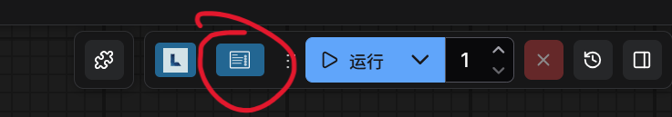
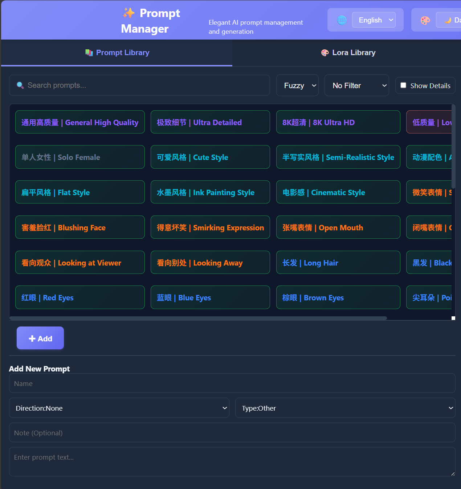
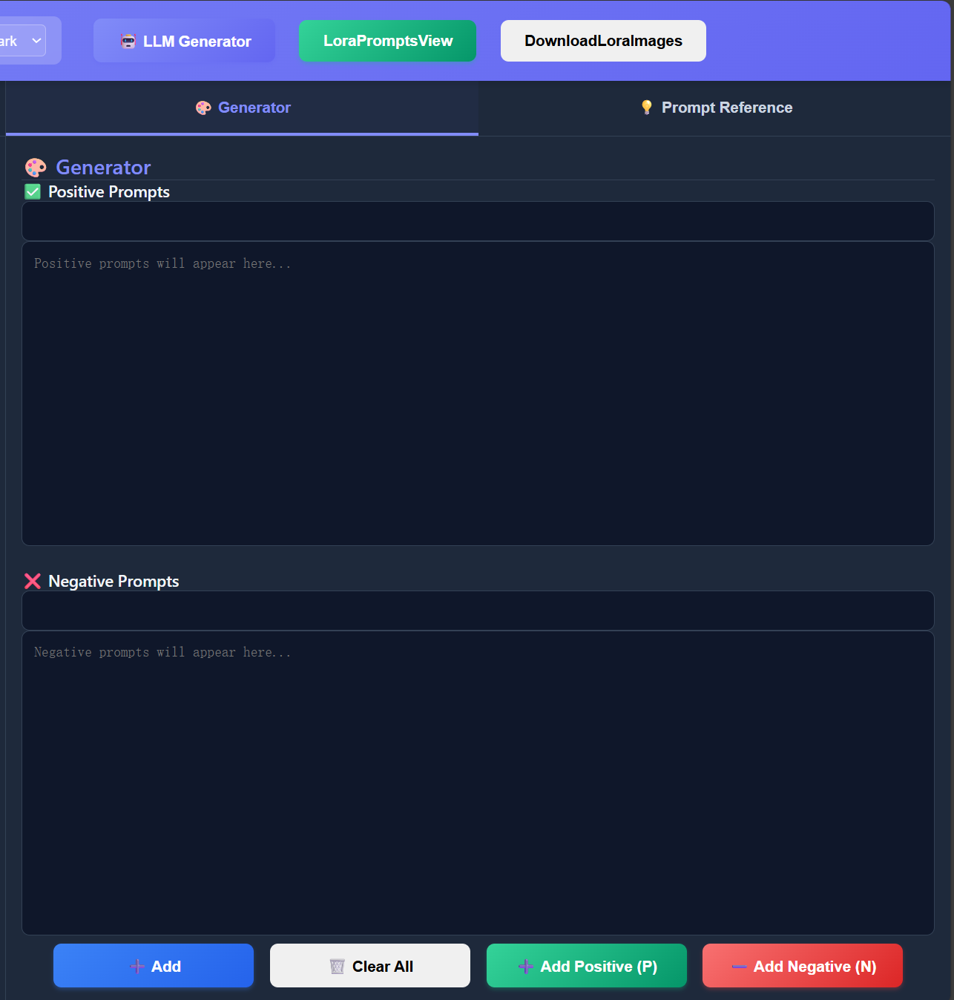
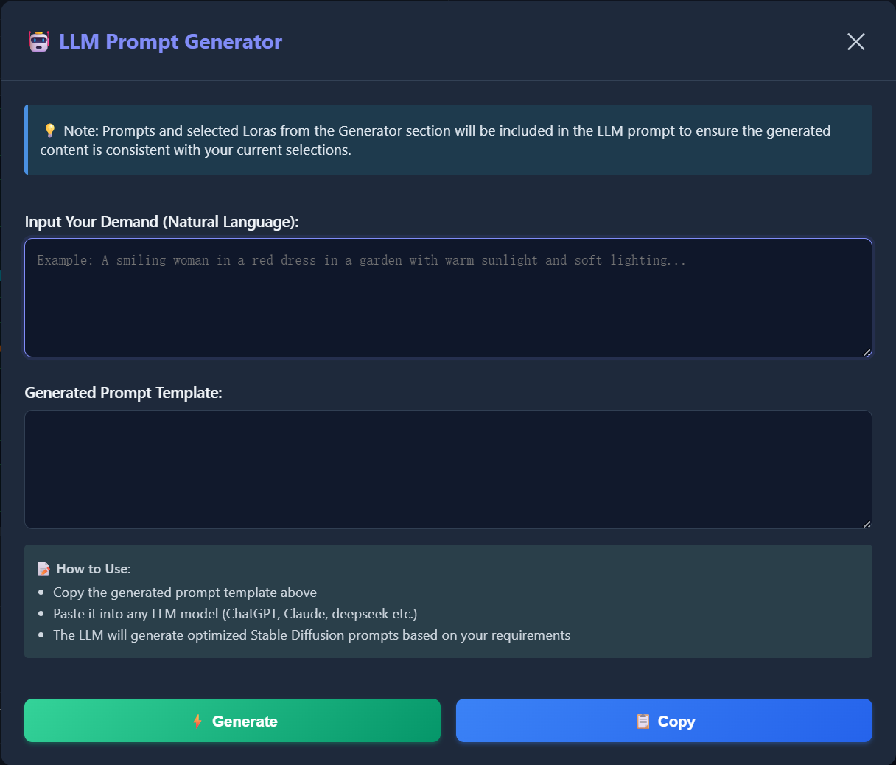
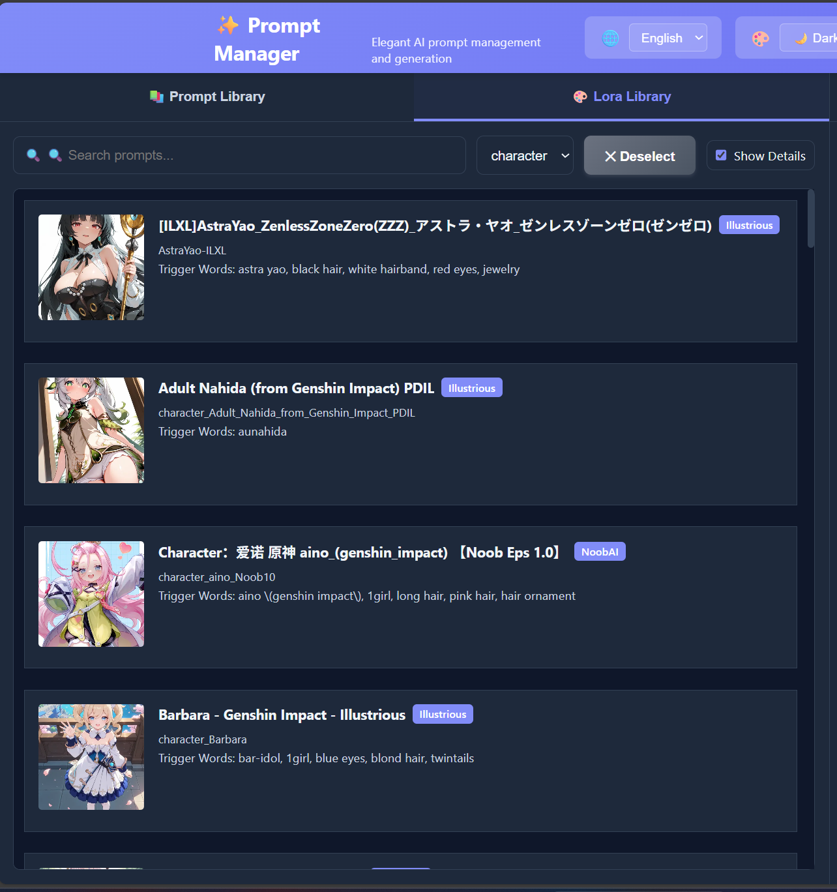
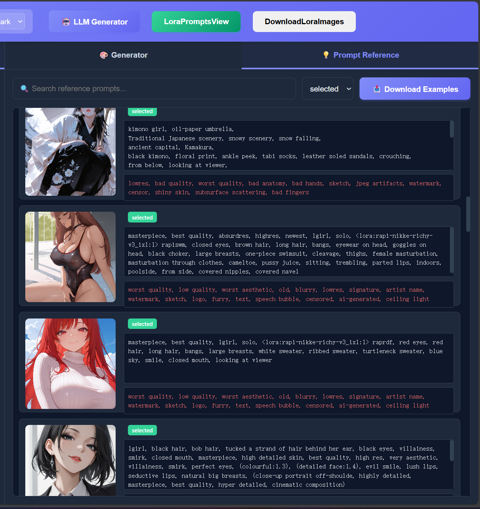
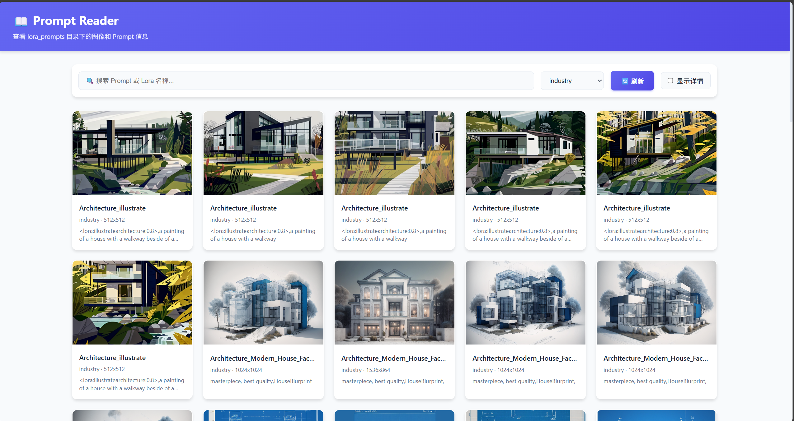

# 🎨 ComfyUI Prompt Manager: Make Prompting as Easy as Grocery Shopping!

An elegant AI prompt and Lora library management and generation system designed for ComfyUI, helping you efficiently manage, search, and generate Stable Diffusion prompts while organizing your Lora models.

Recommended to use with comfyui-lora-manager.

**[中文](README.md) | [English](README.en.md)**

---

## ⚡ Quick Install & Usage

### 1️⃣ Installation

Clone or download the plugin to ComfyUI custom nodes directory:

```bash
cd path/to/ComfyUI/custom_nodes
git clone https://github.com/CeasarSmj/comfyui_simplePromptManage.git
cd comfyui_simplePromptManage
pip install -r requirements.txt
```

Restart ComfyUI, visit `http://localhost:8188/prompt_manage_web/` or click the plugin entry button in the web interface.



### 2️⃣ Basic Concepts

The plugin includes four core features:

| Feature | Description |
| ------------------------ | ------------------------------------------------------------ |
| **Prompt Library** (Tab) | Prompt Library Management - Add, Edit, Delete, Search prompts |
| **Lora Library** (Tab) | Lora Model Management - Browse, categorize, organize local Lora models |
| **Reference** (Tab) | Prompt Reference - View and manage sample images and prompts downloaded from Lora metadata |
| **Generator** (Right Panel) | Prompt Generator - Combine prompts and Loras to generate complete positive/negative prompts |
| **Lora Prompts Viewer** | Standalone Tool - View prompt information from local Lora images |

Each prompt contains:
- **Name**: Short identifier (e.g., "Landscape", "Character")
- **Direction**: Positive (what to generate) / Negative (what to avoid) / None
- **Type**: Category tag - Quality, Style, Texture, Environment, Action, Expression, Clothing, Composition, Other
- **Prompt Text**: Complete prompt content
- **Note** (Optional): Usage instructions and suggestions

---

## 🎯 Core Usage

### 📚 Manage Prompt Library



#### Add Prompt
1. Fill in the "Add New Prompt" form on the left:
   - **Name**: e.g., "High Quality", "Beautiful Character"
   - **Direction**: Select "Positive", "Negative", or "None"
   - **Type**: Choose category from dropdown menu
   - **Note** (Optional): e.g., "Suitable for character generation"
   - **Prompt Text**: Copy and paste prompt content
2. Click "✚ Add" to save

#### Search and Filter
- **Search Box**: Enter keywords to search prompt names (supports fuzzy and exact modes)
- **Type Filter**: Filter by category from dropdown menu
- **Show Details**: Check the box to view complete information for each prompt

#### Edit or Delete
1. Click to select the prompt you want to modify from the list (button will change color to indicate selection)
2. Edit: Click "✏️ Edit Selected" → Modify information → Click "✓ Confirm Edit"
3. Delete: Click "🗑️ Delete Selected" → Confirm deletion

### 🎨 Generate Prompts



#### Method 1: Manual Combination (Recommended for Beginners)
1. Select a prompt from the left prompt library
2. Click buttons to add to the right generator:
   - **➕ Add**: System automatically determines direction and adds to corresponding area
   - **➕ Add Positive (P)**: Force add to positive prompt area
   - **➖ Add Negative (N)**: Force add to negative prompt area
3. Prompt text is automatically appended to the text box on the right
4. Continue adding more prompts to combine
5. Copy the generated prompt to use in ComfyUI

#### Method 2: Keyboard Shortcuts (Efficient)
- Select a prompt and press **`P` key**: Quickly add to positive prompts
- Select a prompt and press **`N` key**: Quickly add to negative prompts

#### Method 3: LLM AI Generation (Professional)
1. Click the "🤖 LLM Generator" button in the top right
2. Describe your requirements in natural language, e.g.:
   ```
   A woman wearing a red dress, smiling, in a garden, with sunshine and soft lighting
   ```
3. Click the "⚡ Generate" button
4. System generates standardized prompt templates based on preset rules (including complete positive and negative prompts)
5. Click the "📋 Copy" button to copy the generated result
6. Optional: Paste to text box for further fine-tuning



### 🎨 Manage Lora Library



#### Browse and Categorize
1. Click the left tab to switch to "🎨 Lora Library"
2. Select Lora category from "All" dropdown menu (automatically generated by directory)
3. Check "Show Details" to view complete information:
   - Lora name and filename
   - Trigger words (for use in generator)
   - Preview images/videos

#### Select and Add to Generator
1. Click the Lora you want to add from the Lora list (it will be highlighted)
2. Click "➕ Add" button to add selected Lora to positive prompt area
3. Lora trigger words will be automatically appended to the prompt text

#### Lora Usage in Generator
- Prompts and Loras are concatenated in **addition order**, not prompts first then Loras
- Lora trigger words are automatically extracted from metadata
- Supports adding multiple Loras simultaneously, prompts are concatenated sequentially

### 💡 Manage Prompt Reference



#### ⚠️ Preparation Before Use
Before using the prompt reference feature, you need to download sample images and data:

1. **Download Sample Images**
   - Click the "📥 Download Examples" button in the title bar
   - System will download sample images and prompts from CivitAI for Lora models
   - Image ID list is located in `prompt_example/selected_img_list.txt`
   - Download process runs in a new window, please wait patiently
   - Downloaded images are saved to `prompt_example/selected/` directory

2. **Lora Directory Structure Requirements**
   - Ensure your `ComfyUI/models/lora/` directory is organized into subdirectories by category
   - Example:
     ```
     ComfyUI/models/lora/
     ├── Characters/
     ├── Styles/
     ├── Clothing/
     └── Backgrounds/
     ```

#### Download Sample Images
1. Click the left tab to switch to "💡 Reference"
2. Click the "📥 Download Examples" button
3. System will automatically download sample images and prompts from CivitAI for Lora models
4. Download progress for each directory will be displayed
5. After download completes, sample images will be displayed in the list

#### View and Use Prompts
1. Browse sample images in the prompt reference list (supports pagination, 200 images per page)
2. Each sample image displays:
   - Thumbnail
   - Positive prompt (scrollable to view complete content)
   - Negative prompt (if available)
   - Generation parameters (steps, sampler, CFG, seed, etc.)
3. Click any reference item to copy its prompt to the generator
4. Use search box to filter by Lora name or prompt content
5. Use category dropdown to filter by directory
6. Scroll to bottom to automatically load more content

#### Download Features
- **Smart Skip**: Existing files are not re-downloaded
- **Empty Prompt Skip**: Skip images without prompts
- **Interruptible**: Click button again during download to cancel
- **Progress Display**: Real-time download progress for each directory
- **Parameter Save**: All generation parameters saved to PNG metadata

### 🖼️ Lora Prompts Viewer


#### ⚠️ Preparation Before Use
Lora Prompts Viewer is a standalone tool that requires data preparation:

**Use DownloadLoraImages Button for One-Click Data Preparation**

1. Click the "DownloadLoraImages" button in the title bar
2. System will automatically perform the following operations:
   - Scan the `ComfyUI/models/lora/` directory
   - Download all Lora model sample images
   - Automatically extract metadata from each image
   - Save as `.json` file with the same name (for fast reading)
3. All images are saved to the `lora_prompts/` directory

**Lora Directory Structure Requirements**
- Ensure your `ComfyUI/models/lora/` directory is organized into subdirectories by category
- Example:
  ```
  ComfyUI/models/lora/
  ├── Characters/
  ├── Styles/
  ├── Clothing/
  └── Backgrounds/
  ```

#### Start Prompt Reader
1. After data preparation is complete, click the "LoraPromptsView" button in the title bar
2. System will start the Prompt Reader service in a new terminal
3. Service address: `http://127.0.0.1:8765`
4. New tab will open automatically

#### Use Features
- **Browse Images**: Browse all Lora sample images by category
- **View Prompts**: Click image to view detailed prompt information
- **Copy Prompts**: One-click copy prompt to clipboard
- **Search Filter**: Search by keywords in prompt or Lora name
- **Category Filter**: Filter images by category directory
- **View Parameters**: Display steps, sampler, CFG, seed, and other generation parameters

#### Performance Optimization
- **Automatic JSON Cache**: JSON files are generated during download, 15-70x faster reading speed
- **Smart Cache**: Millisecond response after first scan
- **orjson Support**: Optional orjson installation for further performance improvement



### 🎛️ Interface Settings

- **Language Switch**: Click the "🌐" icon in the top left to select Chinese or English
- **Theme Switch**: Click the "🎨" icon in the top left to switch between light/dark themes
- **Settings Auto-save**: Language and theme preferences saved to browser local storage

---

## ✨ Features

- ✅ **Prompt Library Management** - Easy create, edit, delete, and search
- ✅ **Lora Library Management** - Browse, categorize, and organize local Lora models
- ✅ **Prompt Reference** - Download and manage sample images and prompts from CivitAI
- ✅ **Lora Prompts Viewer** - Standalone tool to view prompt information from local Lora images
- ✅ **Smart Search** - Supports fuzzy search and exact search
- ✅ **Multi-dimensional Classification** - Organize prompts by direction and type, Loras by directory
- ✅ **AI Assisted Generation** - LLM generates high-quality prompts
- ✅ **Flexible Combination** - Concatenate prompts and Loras in addition order, supports free combination
- ✅ **Keyboard Shortcuts** - P and N keys for quick addition
- ✅ **Bilingual Interface** - Full Chinese and English support
- ✅ **Theme Switching** - Light and dark modes
- ✅ **Auto-save** - Prompts automatically saved to local JSON
- ✅ **Responsive Design** - Adapts to various screen sizes
- ✅ **Pagination** - Prompt reference supports large data pagination
- ✅ **High Performance** - Uses orjson and JSON cache technology, significantly improves read speed

---

## 🛠️ Technical Documentation

### Project Architecture

```
comfyui_PromptManage/
├── __init__.py                      # Backend: Python API server
├── requirements.txt                 # Python dependencies list
├── data/
│   ├── prompts.json                 # User prompt data storage
│   ├── prompts_default.json         # Default prompt library (Chinese)
│   └── prompts_default_en.json      # Default prompt library (English)
├── web/                             # Frontend: Web interface
│   ├── index.html                   # HTML page structure
│   ├── script.js                    # JavaScript interaction logic
│   ├── style.css                    # Stylesheet
│   ├── translations.json            # Multilingual translation configuration
│   ├── llm-templates.json           # LLM generation rules template
│   └── top_menu_extension.js        # ComfyUI menu integration
├── downloadScripts/                 # Download scripts directory
│   ├── __init__.py                  # Package initialization file
│   ├── civitai_client.py            # CivitAI API client
│   ├── download_by_civitaiwebnum.py # Download images from CivitAI Web
│   ├── download_lora_images.py      # Download Lora images
│   └── lora_update_service.py       # Lora metadata update service
├── prompt_reader/                   # Prompt Reader standalone tool
│   ├── app.py                       # Web server
│   ├── app_ultra.py                 # Performance optimized version
│   ├── extract_metadata.py          # Extract image metadata
│   ├── static/                      # Static files
│   │   ├── index.html
│   │   ├── app.js
│   │   └── style.css
│   ├── start.bat                    # Windows startup script
│   ├── start.sh                     # Linux/Mac startup script
│   └── cache/                       # Cache directory
├── prompt_example/                  # Prompt example related
│   ├── LLM_analyze_prompt.md        # LLM prompt analysis rules
│   ├── selected_img_list.txt        # Download image ID list
│   └── selected/                    # Downloaded sample images
├── lora_prompts/                    # Lora sample images directory
│   ├── Characters/
│   ├── Styles/
│   └── ...
└── asset/                           # Asset files and images
    ├── pic_entrance.png             # Entrance screenshot
    ├── pic_cn_overview.png          # Chinese version overview
    ├── pic_en_overview.png          # English version overview
    ├── pic_cn_promptlib.png         # Chinese version prompt library
    ├── pic_en_promptlib.png         # English version prompt library
    ├── pic_cn_generator.png         # Chinese version generator
    ├── pic_en_generator.png         # English version generator
    ├── pic_cn_loralib.png           # Chinese version Lora library
    ├── pic_en_loralib.png           # English version Lora library
    ├── pic_cn_llmgenerate.png       # Chinese version LLM generation
    ├── pic_en_llmgenerate.png       # English version LLM generation
    ├── pic_cn_reference.png         # Chinese version prompt reference
    ├── pic_en_reference.png         # English version prompt reference
    ├── pic_loraPromptsViewer_entrance_and_download.png
    └── pic_promptReader.png         # Prompt Reader tool
```

### API Endpoints

#### Prompt Management API

| Method | Endpoint | Function |
| ---- | ----------------------- | -------------- |
| POST | `/prompt_manage/get` | Get all prompts |
| POST | `/prompt_manage/add` | Add new prompt |
| POST | `/prompt_manage/update` | Update specified prompt |
| POST | `/prompt_manage/delete` | Delete specified prompt |
| POST | `/prompt_manage/save` | Save all prompts |

#### Lora Library Management API

| Method | Endpoint | Function |
| ------ | -------------------------- | ---------------------- |
| GET | `/prompt_manage/lora/list` | Get all Lora model list |

#### Download Scripts API

| Method | Endpoint | Function |
| ------ | ------------------------------------- | ------------------------ |
| POST | `/prompt_manage/download_by_civitaiwebnum` | Start CivitAI Web download |
| POST | `/prompt_manage/download_lora_images` | Start Lora image download |
| POST | `/prompt_manage/start_prompt_reader` | Start Prompt Reader |

#### API Usage Examples

**Add Prompt**
```bash
POST /prompt_manage/add
Content-Type: application/json

{
    "name": "Landscape",
    "direction": "None",
    "type": "Environment",
    "text": "beautiful landscape, mountains, clear sky",
    "note": "Natural landscape prompts"
}
```

**Delete Prompt**
```bash
POST /prompt_manage/delete
Content-Type: application/json

{
    "index": 0
}
```

### Data Format

Prompt data is stored as a JSON array, location: `data/prompts.json`

**Important: name and note fields must use bilingual format**

```json
[
    {
        "name": "Chinese Name | English Name",
        "direction": "Positive|Negative|None",
        "type": "Quality|Style|Texture|Environment|Action|Expression|Clothing|Composition|Other",
        "text": "Prompt content...",
        "note": "Chinese note | English note"
    }
]
```

**Bilingual Format Rules:**
- Format: `Chinese | English`
- Separator: ` | ` (space + pipe + space)
- Order: Chinese first, English second
- name field: Must use bilingual format
- note field: Recommended to use bilingual format

### Code Documentation

#### Backend (__init__.py)
- **load_prompts()** - Load prompts from JSON file
- **save_prompts(data)** - Save prompts to JSON file
- **API Route Handling** - Handle add, delete, update, get prompt requests
- **web Directory Mounting** - Static file service, providing Web interface
- **Lora Library Management** - Load, categorize, browse, select Lora models
- **Download Scripts Management** - Start various download scripts
- **Prompt Reader Startup** - Start standalone tool in new window
- **orjson Optimization** - Use orjson for performance improvement

#### Frontend (script.js)
- **Internationalization System** - Load multilingual configuration from translations.json
- **Prompt Library Management** - Frontend implementation of CRUD operations
- **Search and Filter** - Fuzzy search, exact search, and category filtering logic
- **Keyboard Shortcut Handling** - P/N key event listening and processing
- **LLM Integration** - Call LLM API to generate prompts
- **Theme and Language** - Dynamic interface theme and language switching, persisted with localStorage
- **Pagination** - Scroll pagination for prompt reference
- **Prompt Reader Integration** - Call API to start standalone tool

#### Styles (style.css)
- **Responsive Layout** - Two-column design (left library, right generator)
- **Theme System** - CSS variables for light/dark theme switching
- **Component Styles** - Complete styles for buttons, forms, lists, and other UI components

### LLM Prompt Generation Rules

The LLM generator is based on 8 preset rules to ensure generated prompts:
1. All English, no Chinese
2. Prioritize short phrases, avoid unnecessary complete sentences
3. Comma-separated, consecutive elements of same type, line breaks for different categories
4. Follow priority order: Quality > Subject > Clothing > Action > Environment > Art Style
5. Group descriptions by character for multiple characters
6. Must include quality words at the beginning (masterpiece, best quality, etc.)
7. Provide multiple synonyms for important features
8. Support weight syntax: (keyword:1.2) strengthen, [keyword] weaken

See `web/llm-templates.json` and `prompt_example/LLM_analyze_prompt.md` for details

---

## 💡 Usage Tips

- Regularly organize your prompt library, delete outdated or duplicate entries
- Make full use of the "Note" field to record prompt usage and effects (use bilingual format)
- Name prompts according to application scenarios for easy searching
- Create multiple variants for common prompts (e.g., different styles, quality levels)
- Save successful prompt combinations as reusable templates
- Use type filtering to quickly locate specific category prompts
- Use Prompt Reader tool to view and manage prompt information from local Lora images
- Use "DownloadLoraImages" button to download and extract metadata from all Lora images at once
- Regularly run download scripts to update your Lora image library

---

## 📄 License

MIT License

---

**Version**: 2.0.0  
**Last Updated**: January 30, 2026  
**GitHub**: [comfyui_PromptManage](https://github.com/CeasarSmj/comfyui_PromptManage)

Welcome to submit Issues and Pull Requests!