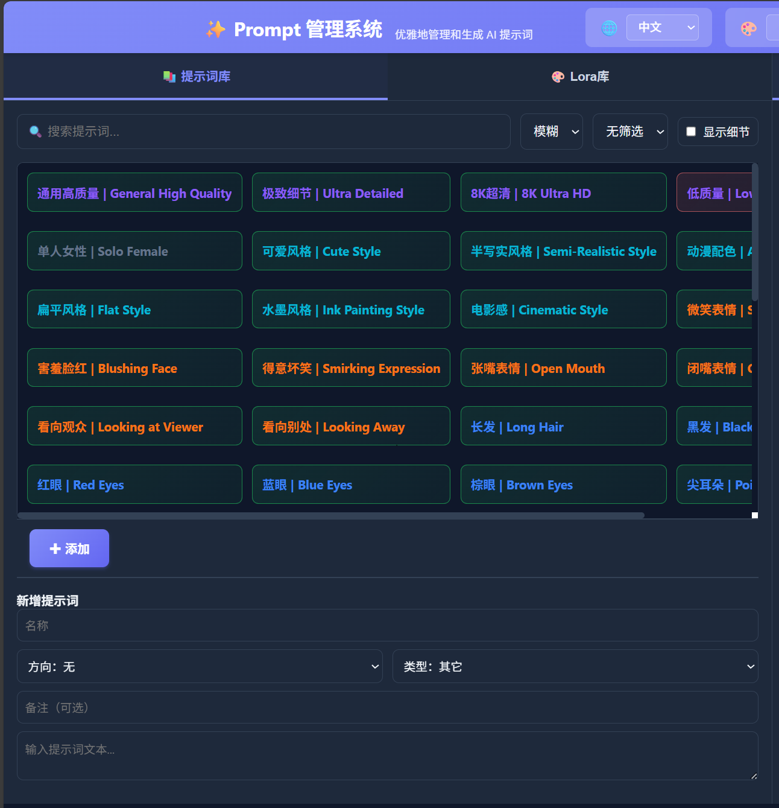
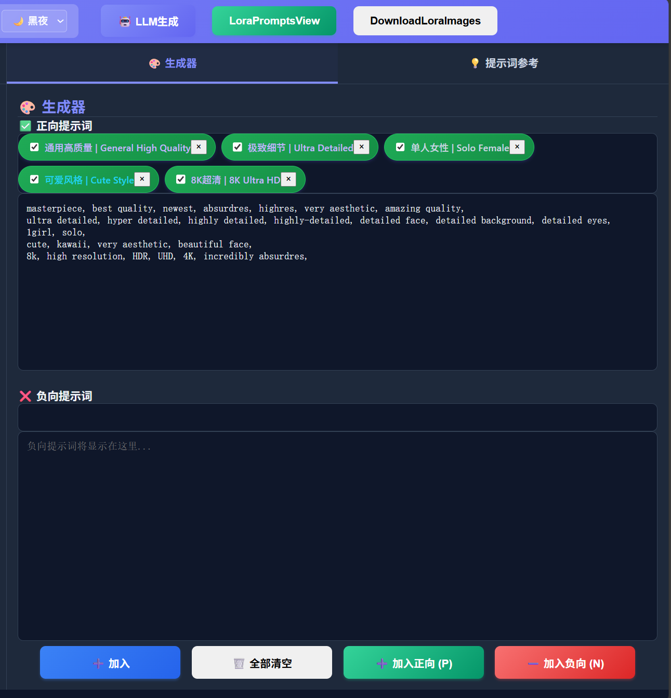
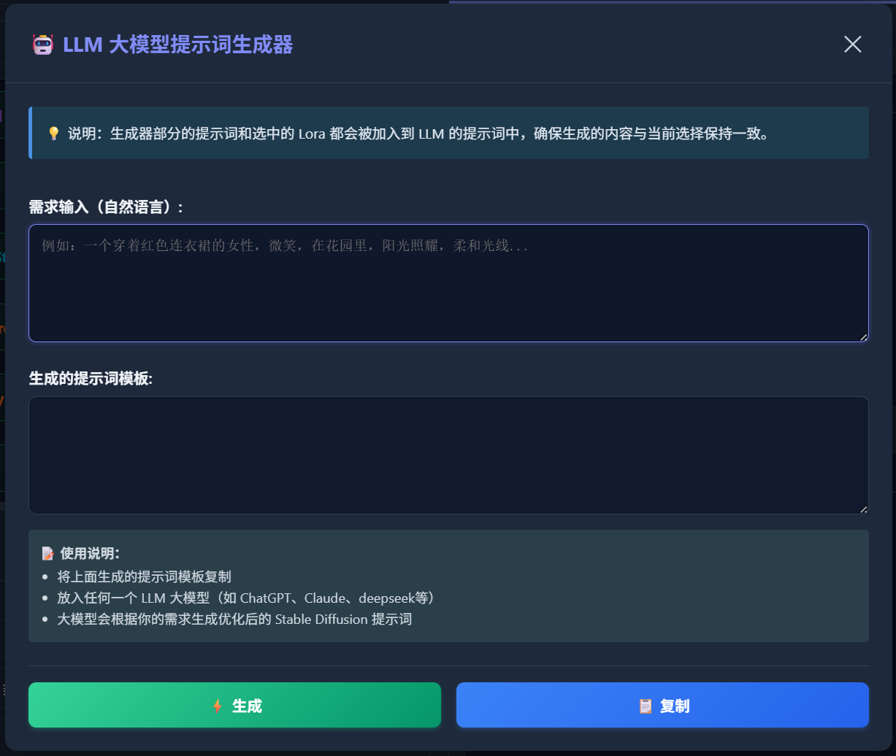
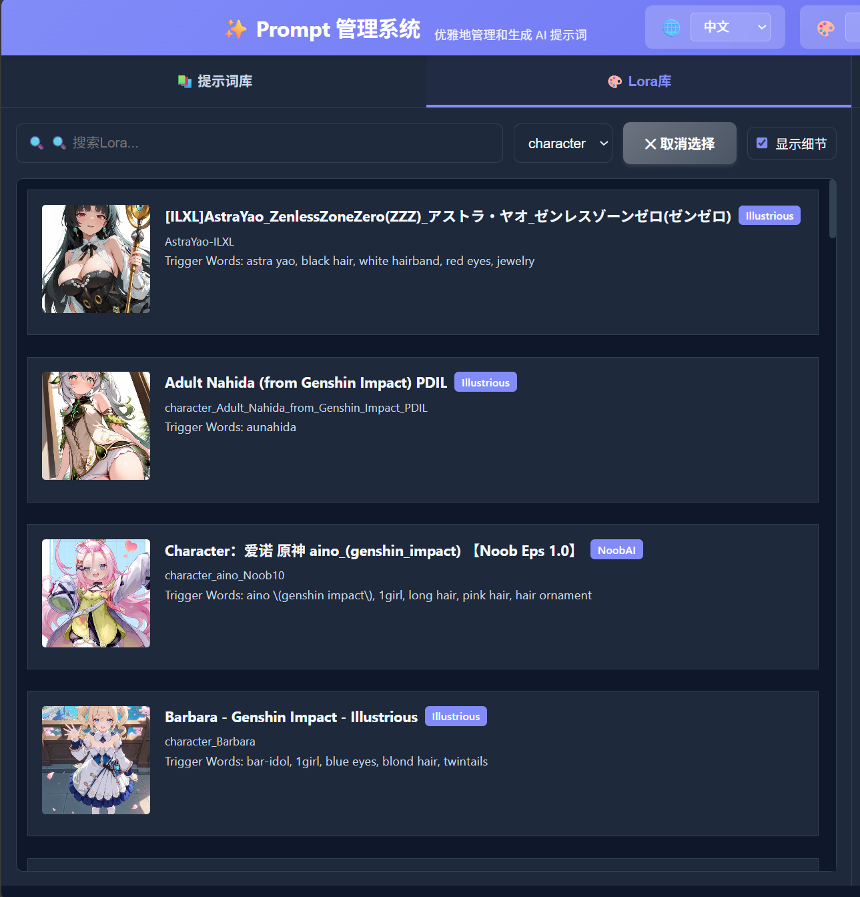
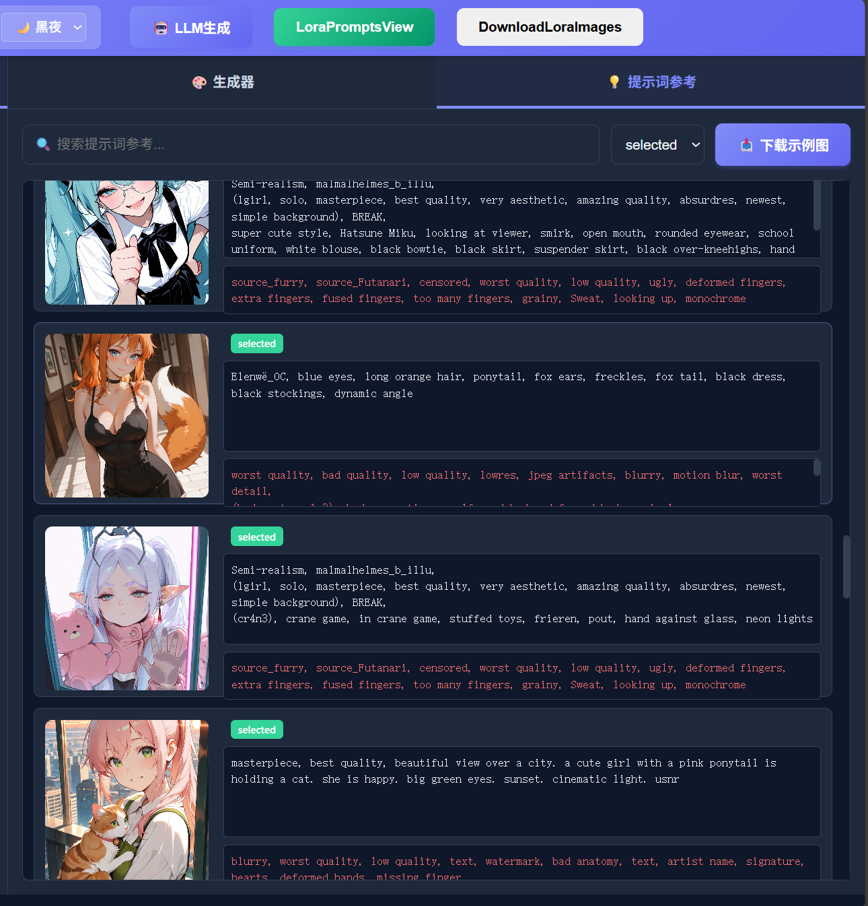

# 🎨 ComfyUI Prompt Manager : 让写 prompts 变得像超市采购一样简单！

为 ComfyUI 设计的优雅 AI 提示词和 Lora 库管理与生成系统，帮助您高效地管理、搜索和生成 Stable Diffusion 提示词，同时管理和组织 Lora 模型。

建议和 comfyui-lora-manager 搭配使用。

**[中文](README.md) | [English](README.en.md)**

---

## ⚡ 快速安装与使用

### 1️⃣ 安装

将插件克隆或下载到 ComfyUI 自定义节点目录：

```bash
cd path/to/ComfyUI/custom_nodes
git clone https://github.com/CeasarSmj/comfyui_simplePromptManage.git
cd comfyui_simplePromptManage
pip install -r requirements.txt
```

重启 ComfyUI，访问 `http://localhost:8188/prompt_manage_web/` 或在网页界面中点击插件入口按钮。


### 2️⃣ 基础概念

插件包含四大核心功能：

| 功能                     | 说明                                                         |
| ------------------------ | ------------------------------------------------------------ |
| **提示词库**（选项卡）   | 提示词库管理 - 添加、编辑、删除、搜索提示词                  |
| **Lora库**（选项卡）     | Lora 模型管理 - 浏览、分类、组织本地 Lora 模型               |
| **提示词参考**（选项卡） | 提示词参考 - 查看和管理从 Lora metadata 下载的示例图和提示词 |
| **生成器**（右侧面板）   | 提示词生成器 - 组合提示词和 Lora 生成完整的正向/负向提示词   |
| **Lora示例提示词查看**  | 独立工具 - 查看本地 Lora 图像的提示词信息                   |

每条提示词包含：
- **名称**：提示词的简短标识（如"风景"、"人物"）
- **方向**：正向（要生成的内容）/ 反向（要避免的内容）/ 无
- **类型**：分类标签 - 质量、风格、质感、环境、动作、表情、着装、构图、其它
- **提示词文本**：完整的提示词内容
- **备注**（可选）：用途说明和使用建议

---

## 🎯 核心使用方式

### 📚 管理提示词库



#### 添加提示词
1. 在左侧"新增提示词"表单中填写：
   - **名称**：例如 "高质量画面 | High Quality"
   - **方向**：选择"正向"、"反向"或"无"
   - **类型**：从下拉菜单选择分类
   - **备注**（可选）：例如"适合人物生成 | Suitable for character generation"
   - **提示词文本**：复制粘贴提示词内容
2. 点击"✚ 添加"保存

#### 搜索和筛选
- **搜索框**：输入关键词查找提示词名称（支持模糊和精确两种模式）
- **类型筛选**：从下拉菜单按分类过滤
- **显示细节**：勾选复选框查看每条提示词的完整信息

#### 编辑或删除
1. 从列表中点击选中要修改的提示词（按钮会变色表示选中）
2. 编辑：点击"✏️ 编辑选中" → 修改信息 → 点击"✓ 确认编辑"
3. 删除：点击"🗑️ 删除选中" → 确认删除

### 🎨 生成提示词



#### 方式1：手动组合（推荐入门）
1. 在左侧提示词库中选中一条提示词
2. 点击按钮添加到右侧生成器：
   - **➕ 加入**：系统自动根据方向判断，添加到对应区域
   - **➕ 加入正向 (P)**：强制添加到正向提示词区域
   - **➖ 加入负向 (N)**：强制添加到负向提示词区域
3. 提示词文本自动拼接到右侧的文本框中
4. 继续添加更多提示词进行组合
5. 完成后复制生成的提示词到 ComfyUI 使用

#### 方式2：快捷键（高效）
- 选中提示词后按 **`P` 键**：快速添加到正向提示词
- 选中提示词后按 **`N` 键**：快速添加到负向提示词

#### 方式3：LLM AI 生成（专业）
1. 点击右上角"🤖 LLM生成"按钮
2. 在对话框中用自然语言描述您的需求，例如：
   ```
   一个穿着红色连衣裙的女性，微笑，在花园里，阳光照耀，柔和的光线
   ```
3. 点击"⚡ 生成"按钮
4. 系统基于预设规则生成标准化提示词模板（包含完整的正向和负向提示词）
5. 点击"📋 复制"按钮复制生成结果
6. 可选：粘贴到文本框继续微调



### 🎨 管理 Lora 库



#### 浏览和分类
1. 点击左侧选项卡切换到"🎨 Lora库"
2. 从"全部"下拉菜单选择 Lora 分类（自动按目录生成）
3. 勾选"显示细节"查看完整信息：
   - Lora 名称和文件名
   - 触发词（用于生成器中使用）
   - 预览图片/视频

#### 选中并添加到生成器
1. 在 Lora 列表中点击要添加的 Lora（会高亮显示）
2. 点击"➕ 加入"按钮将选中的 Lora 添加到正向提示词区域
3. Lora 的触发词会自动追加到提示词文本中

#### Lora 在生成器中的使用
- 提示词和 Lora 会按照 **添加顺序** 拼接，而不是先提示词后 Lora
- Lora 触发词会自动从元数据中提取
- 支持同时添加多个 Lora，提示词会依次拼接

### 💡 管理提示词参考



#### ⚠️ 使用前准备
在使用提示词参考功能之前，需要先下载示例图像和数据：

1. **下载示例图像**
   - 点击标题栏的"📥 Download Examples"按钮
   - 系统会从 CivitAI 下载 Lora 模型的示例图像和提示词
   - 图像编号列表位于 `prompt_example/selected_img_list.txt`
   - 下载过程会在新窗口中运行，请耐心等待
   - 下载的图像会保存到 `prompt_example/selected/` 目录

2. **Lora 目录结构要求**
   - 确保您的 `ComfyUI/models/lora/` 目录已按类别整理成子目录结构
   - 例如：
     ```
     ComfyUI/models/lora/
     ├── 人物/
     ├── 风格/
     ├── 服装/
     └── 背景/
     ```

#### 下载示例图
1. 点击左侧选项卡切换到"💡 提示词参考"
2. 点击"📥 Download Examples"按钮
3. 系统会自动从 CivitAI 下载 Lora 模型的示例图像和提示词
4. 下载过程中会显示每个目录的下载进度
5. 下载完成后，示例图会显示在列表中

#### 查看和使用提示词
1. 在提示词参考列表中浏览示例图（支持分页加载，每次200张）
2. 每个示例图显示：
   - 缩略图
   - 正向提示词（可滚动查看完整内容）
   - 负向提示词（如果有）
   - 生成参数（步数、采样器、CFG、种子等）
3. 点击任意参考项可复制其提示词到生成器
4. 使用搜索框按 Lora 名称或提示词内容筛选
5. 使用类别下拉菜单按目录筛选
6. 滚动到底部会自动加载更多内容

#### 下载功能特点
- **智能跳过**：已存在的文件不会重复下载
- **空提示词跳过**：跳过没有提示词的图像
- **可中断**：下载过程中再次点击按钮可取消下载
- **进度显示**：实时显示每个目录的下载进度
- **参数保存**：所有生成参数保存到 PNG metadata 中

### 🖼️ Lora 示例提示词查看


#### ⚠️ 使用前准备
Lora 示例提示词查看功能是一个独立的工具，需要先准备数据：

**使用 DownloadLoraImages 按钮一键准备数据**

1. 点击标题栏的"DownloadLoraImages"按钮
2. 系统会自动执行以下操作：
   - 扫描 `ComfyUI/models/lora/` 目录
   - 下载所有 Lora 模型的示例图像
   - 自动提取每张图像的 metadata
   - 保存为同名的 `.json` 文件（用于快速读取）
3. 所有图像保存到 `lora_prompts/` 目录

**Lora 目录结构要求**
- 确保您的 `ComfyUI/models/lora/` 目录已按类别整理成子目录结构
- 例如：
  ```
  ComfyUI/models/lora/
  ├── 人物/
  ├── 风格/
  ├── 服装/
  └── 背景/
  ```

#### 启动 Prompt Reader
1. 数据准备完成后，点击标题栏的"LoraPromptsView"按钮
2. 系统会在新终端中启动 Prompt Reader 服务
3. 服务地址：`http://127.0.0.1:8765`
4. 新标签页会自动打开

#### 使用功能
- **浏览图像**：按类别浏览所有 Lora 示例图像
- **查看 Prompt**：点击图像查看详细的 prompt 信息
- **复制 Prompt**：一键复制 prompt 到剪贴板
- **搜索筛选**：按关键词搜索 prompt 或 Lora 名称
- **分类筛选**：按类别目录筛选图像
- **查看参数**：显示步数、采样器、CFG、种子等生成参数

#### 性能优化
- **自动 JSON 缓存**：下载时自动生成 JSON 文件，读取速度提升 15-70 倍
- **智能缓存**：首次扫描后，后续访问毫秒级响应
- **orjson 支持**：可选安装 orjson 库进一步提升性能


### 🎛️ 界面设置

- **语言切换**：点击左上角"🌐"图标选择中文或英文
- **主题切换**：点击左上角"🎨"图标在亮色/暗色主题间切换
- **设置自动保存**：语言和主题偏好保存到浏览器本地存储

---

## ✨ 功能特性

- ✅ **提示词库管理** - 轻松创建、编辑、删除和搜索
- ✅ **Lora 库管理** - 浏览、分类和组织本地 Lora 模型
- ✅ **提示词参考** - 从 CivitAI 下载并管理示例图像和提示词
- ✅ **Lora 示例查看** - 独立工具查看本地 Lora 图像的 prompt 信息
- ✅ **智能搜索** - 支持模糊搜索和精确搜索
- ✅ **多维度分类** - 按方向和类型组织提示词，按目录分类 Lora
- ✅ **AI 辅助生成** - LLM 大模型生成高质量提示词
- ✅ **灵活组合** - 按添加顺序拼接提示词和 Lora，支持自由组合
- ✅ **快捷键支持** - P 和 N 键快速添加
- ✅ **双语界面** - 完整支持中文和英文
- ✅ **主题切换** - 亮色和暗色模式
- ✅ **自动保存** - 提示词自动保存到本地 JSON
- ✅ **响应式设计** - 适配各种屏幕尺寸
- ✅ **分页加载** - 提示词参考支持大容量数据的分页加载
- ✅ **高性能** - 使用 orjson 和 JSON 缓存技术，大幅提升读取速度

---

## 🛠️ 技术文档

### 项目架构

```
comfyui_PromptManage/
├── __init__.py                      # 后端：Python API 服务器
├── requirements.txt                 # Python 依赖包列表
├── data/
│   ├── prompts.json                 # 用户提示词数据存储
│   ├── prompts_default.json         # 默认提示词库（中文）
│   └── prompts_default_en.json      # 默认提示词库（英文）
├── web/                             # 前端：Web 界面
│   ├── index.html                   # HTML 页面结构
│   ├── script.js                    # JavaScript 交互逻辑
│   ├── style.css                    # 样式表
│   ├── translations.json            # 多语言翻译配置
│   ├── llm-templates.json           # LLM 生成规则模板
│   └── top_menu_extension.js        # ComfyUI 菜单集成
├── downloadScripts/                 # 下载脚本目录
│   ├── __init__.py                  # 包初始化文件
│   ├── civitai_client.py            # CivitAI API 客户端
│   ├── download_by_civitaiwebnum.py # 从 CivitAI Web 下载图像
│   ├── download_lora_images.py      # 下载 Lora 图像
│   └── lora_update_service.py       # Lora 元数据更新服务
├── prompt_reader/                   # Prompt Reader 独立工具
│   ├── app.py                       # Web 服务器
│   ├── app_ultra.py                 # 性能优化版本
│   ├── extract_metadata.py          # 提取图像 metadata
│   ├── static/                      # 静态文件
│   │   ├── index.html
│   │   ├── app.js
│   │   └── style.css
│   ├── start.bat                    # Windows 启动脚本
│   ├── start.sh                     # Linux/Mac 启动脚本
│   └── cache/                       # 缓存目录
├── prompt_example/                  # 提示词示例相关
│   ├── LLM_analyze_prompt.md        # LLM 分析提示词规则
│   ├── selected_img_list.txt        # 下载图像 ID 列表
│   └── selected/                    # 下载的示例图像
├── lora_prompts/                    # Lora 示例图像目录
│   ├── 人物/
│   ├── 风格/
│   └── ...
└── asset/                           # 资源文件和图片
    ├── pic_entrance.png             # 入口截图
    ├── pic_cn_overview.png          # 中文版概览
    ├── pic_en_overview.png          # 英文版概览
    ├── pic_cn_promptlib.png         # 中文版提示词库
    ├── pic_en_promptlib.png         # 英文版提示词库
    ├── pic_cn_generator.png         # 中文版生成器
    ├── pic_en_generator.png         # 英文版生成器
    ├── pic_cn_loralib.png           # 中文版Lora库
    ├── pic_en_loralib.png           # 英文版Lora库
    ├── pic_cn_llmgenerate.png       # 中文版LLM生成
    ├── pic_en_llmgenerate.png       # 英文版LLM生成
    ├── pic_cn_reference.png         # 中文版提示词参考
    ├── pic_en_reference.png         # 英文版提示词参考
    ├── pic_loraPromptsViewer_entrance_and_download.png
    └── pic_promptReader.png         # Prompt Reader 工具
```

### API 接口

#### 提示词管理 API

| 方法 | 端点                    | 功能           |
| ---- | ----------------------- | -------------- |
| POST | `/prompt_manage/get`    | 获取所有提示词 |
| POST | `/prompt_manage/add`    | 添加新提示词   |
| POST | `/prompt_manage/update` | 更新指定提示词 |
| POST | `/prompt_manage/delete` | 删除指定提示词 |
| POST | `/prompt_manage/save`   | 保存所有提示词 |

#### Lora 库管理 API

| 方法   | 端点                       | 功能                   |
| ------ | -------------------------- | ---------------------- |
| GET    | `/prompt_manage/lora/list` | 获取所有 Lora 模型列表 |

#### 下载脚本 API

| 方法   | 端点                                  | 功能                     |
| ------ | ------------------------------------- | ------------------------ |
| POST   | `/prompt_manage/download_by_civitaiwebnum` | 启动 CivitAI Web 下载 |
| POST   | `/prompt_manage/download_lora_images`      | 启动 Lora 图像下载   |
| POST   | `/prompt_manage/start_prompt_reader`       | 启动 Prompt Reader  |

#### API 使用示例

**添加提示词**
```bash
POST /prompt_manage/add
Content-Type: application/json

{
    "name": "风景 | Landscape",
    "direction": "无",
    "type": "环境",
    "text": "beautiful landscape, mountains, clear sky",
    "note": "自然风景提示词 | Natural landscape prompts"
}
```

**删除提示词**
```bash
POST /prompt_manage/delete
Content-Type: application/json

{
    "index": 0
}
```

### 数据格式

提示词数据存储为 JSON 数组，位置：`data/prompts.json`

**重要：name 和 note 字段必须使用中英双语格式**

```json
[
    {
        "name": "提示词名称 | English Name",
        "direction": "正向|反向|无",
        "type": "质量|风格|质感|环境|动作|表情|着装|构图|其它",
        "text": "提示词内容...",
        "note": "中文说明 | English Note"
    }
]
```

**双语格式规则：**
- 格式：`中文 | English`
- 分隔符：` | `（空格 + 竖线 + 空格）
- 顺序：中文在前，英文在后
- name 字段：必须使用双语格式
- note 字段：推荐使用双语格式

### 代码说明

#### 后端 (__init__.py)
- **load_prompts()** - 从 JSON 文件加载提示词
- **save_prompts(data)** - 将提示词保存到 JSON 文件
- **API 路由处理** - 处理添加、删除、更新、获取提示词的请求
- **web 目录挂载** - 静态文件服务，提供 Web 界面
- **Lora 库管理** - 加载、分类、浏览、选择 Lora 模型
- **下载脚本管理** - 启动各种下载脚本
- **Prompt Reader 启动** - 在新窗口中启动独立工具
- **orjson 优化** - 使用 orjson 提升性能

#### 前端 (script.js)
- **国际化系统** - 从 translations.json 加载多语言配置
- **提示词库管理** - CRUD 操作的前端实现
- **搜索和筛选** - 模糊搜索、精确搜索和分类筛选逻辑
- **快捷键处理** - P/N 键事件监听和处理
- **LLM 集成** - 调用大模型 API 生成提示词
- **主题和语言** - 动态切换界面主题和语言，使用 localStorage 持久化
- **分页加载** - 提示词参考的滚动分页加载
- **Prompt Reader 集成** - 调用 API 启动独立工具

#### 样式 (style.css)
- **响应式布局** - 两栏设计（左侧库，右侧生成器）
- **主题系统** - CSS 变量实现亮色/暗色主题切换
- **组件样式** - 按钮、表单、列表等 UI 组件的完整样式

### LLM 提示词生成规则

LLM 生成器基于预设的 8 条规则，确保生成的提示词：
1. 全英文，无中文
2. 优先使用简短短语，非必要不写完整句子
3. 逗号分隔，同类元素连续，不同类别换行
4. 遵循优先顺序：质量 > 主体 > 着装 > 动作 > 环境 > 画风
5. 多人物时按人物分组描述
6. 开头必含高质量词（masterpiece, best quality 等）
7. 重要特征提供多个同义词
8. 支持权重语法：(keyword:1.2) 加强，[keyword] 减弱

详见 `web/llm-templates.json` 和 `prompt_example/LLM_analyze_prompt.md`

---

## 💡 使用建议

- 定期整理提示词库，删除过时或重复的条目
- 充分利用"备注"字段记录提示词的用途和效果（使用双语格式）
- 按照应用场景给提示词命名，便于后续搜索
- 为常用提示词创建多个变体（如不同风格、不同质量级别）
- 保存成功生成的提示词组合，形成可复用的模板
- 利用类型筛选功能快速定位某类提示词
- 使用 Prompt Reader 工具查看和管理本地 Lora 图像的 prompt 信息
- 使用"DownloadLoraImages"按钮一键下载和提取所有 Lora 图像的 metadata
- 定期运行下载脚本更新 Lora 图像库

---

## 📄 许可证

MIT License

---

**版本**：2.0.0  
**最后更新**：2026 年 1 月 30 日  
**GitHub**：[comfyui_PromptManage](https://github.com/CeasarSmj/comfyui_PromptManage)

欢迎提交 Issue 和 Pull Request！